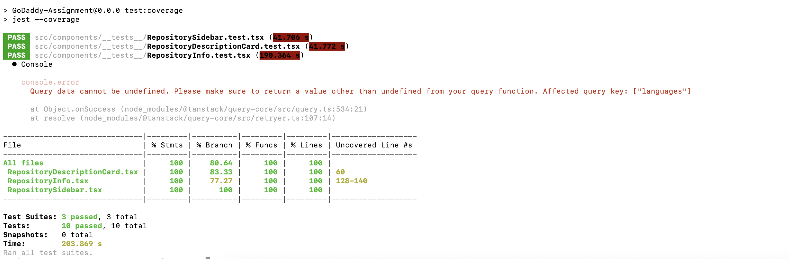

# Readme

### Basic Setup

1. Dependencies: NodeJs, React, Typescript, Vite
2. Clone the repository
3. Run `npm install` to install dependencies
4. Run `npm run dev` to start the development server
5. Open the browser and navigate to `http://localhost:5173`
6. You are ready to go!

### Project Structure

```
📁 src
├── 📁 assets
│   ├── 🖼️ image.png
│   └── 🧬 react.svg
├── 📁 components
│   ├── 📁 __tests__
│   │   ├── 🧪 RepositoryDescriptionCard.test.tsx
│   │   ├── 🧪 RepositoryInfo.test.tsx
│   │   └── 🧪 RepositorySidebar.test.tsx
│   ├── 📄 Loader.tsx
│   ├── 📄 RepositoryDescriptionCard.tsx
│   ├── 📄 RepositoryInfo.tsx
│   ├── 📄 RepositorySidebar.tsx
│   └── 📄 index.ts
├── 📁 mocks
│   └── 📄 repo.ts
├── 📁 pages
│   └── 📄 RepositoryList.tsx
├── 📁 types
├── 📄 App.css
├── 📄 App.tsx
├── 📄 index.css
├── 📄 main.tsx
├── 📄 setupTests.ts
├── 📄 vite-env.d.ts
📄 .gitignore
📄 eslint.config.js
📄 index.html
📄 jest.config.ts
📄 package-lock.json
📄 package.json
📄 README.md
📄 tsconfig.app.json
📄 tsconfig.json
📄 tsconfig.node.json
📄 vite.config.ts

```

### Project Dependencies

#### React

- React Router
- React Query

#### Material UI

- Material UI
- Material Icons

#### Other

- Typescript
- ESLint
- Prettier

### Testing Framework

- Jest
- React Testing Library



### Screenshot


